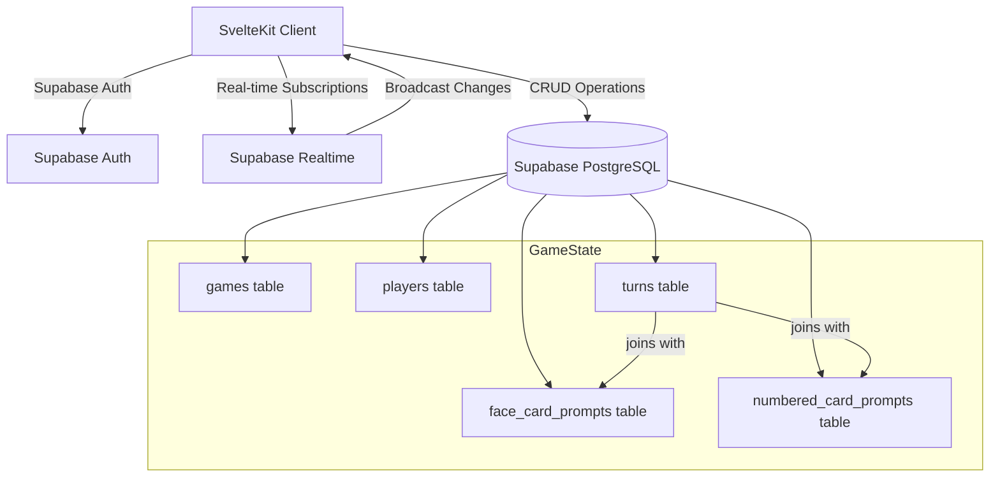

# Ground Itself TTRPG Migration Plan

## Overview

Migrate "The Ground Itself" storytelling game from React + sockets to Svelte 5 + TypeScript + Supabase. The game uses card-based prompts for collaborative storytelling about locations, with real-time synchronization of game state.

**Reference Implementation**: See `/Users/daviddaw/Ground-Itself-Full` for the original React + Socket.io implementation.

## Architecture

### Data Flow



### Database Schema

**games** table:

- `id` (uuid, primary key)
- `code` (text, unique, indexed) - game join code
- `title` (text) - game title to help players identify the game
- `created_by` (uuid, foreign key to auth.users)
- `current_phase` (integer) - game phase: `0` (waiting room), `1` (time length), `2` (establishing), `3` (drawing cards), `4` (end game)
- `ten_flag` (boolean) - true when card 10 is rolled (cycle end)
- `focused_flag` (boolean) - true when focused situation is active
- `cycle` (integer) - current gameplay cycle (1-4)
- `roll` (integer, nullable) - random roll for time advancement (1-6)
- `play_length` (text, nullable) - cycle length: "Days", "Weeks", "Years", "Decades", "Centuries", "Millennia"
- `location` (text) - game location
- `selected_tens` (text[]) - array of selected cycle-end questions (gardens, victory, loss, death, resting)
- `current_turn_player_id` (uuid, nullable, foreign key to players)
- `last_turn_player_id` (uuid, nullable, foreign key to players)
- `created_at` (timestamp)
- `updated_at` (timestamp)

**players** table:

- `id` (uuid, primary key)
- `game_id` (uuid, foreign key to games)
- `display_name` (text)
- `user_id` (uuid, nullable, foreign key to auth.users) - null for anonymous players
- `joined_at` (timestamp)
- `turn_order` (integer) - position in turn rotation
- `connected` (boolean) - whether player is currently connected
- `confirm_location` (boolean) - whether player has confirmed location

**face_card_prompts** table (reference data - static face card prompt definitions):

- `id` (integer, primary key) - prompt ID from 1-12 (12 establishing prompts total)
- `prompt_text` (text) - the actual prompt text
- `created_at` (timestamp)

**numbered_card_prompts** table (reference data - static numbered card prompt definitions):

- `id` (uuid, primary key)
- `card_number` (integer) - the card number (2-9, card 10 is special and triggers cycle end)
- `draw_order` (integer) - which time this card is drawn (1, 2, 3, or 4)
- `prompt_text` (text) - the actual prompt text
- `created_at` (timestamp)
- Unique constraint on (`card_number`, `draw_order`)

**Note**: Card 10 is special - when rolled (randomIndex === 9), it triggers cycle end, not a regular prompt

**turns** table (game events - tracks card draws):

- `id` (uuid, primary key)
- `game_id` (uuid, foreign key to games)
- `player_id` (uuid, foreign key to players)
- `turn_number` (integer) - sequential turn number in the game
- `drawn_at` (timestamp)
- **Face card fields** (for Phase 2 - Establishing):
  - `face_prompt_id` (integer, nullable, foreign key to face_card_prompts.id) - which face card prompt was drawn (1-12)
- **Numbered card fields** (for Phase 3 - Drawing Cards):
  - `card_number` (integer, nullable) - which numbered card was drawn (2-9, card 10 triggers cycle end)
  - `draw_order` (integer, nullable) - which time this card number was drawn (1, 2, 3, or 4)
- Check constraint: exactly one of (`face_prompt_id` IS NOT NULL) or (`card_number` IS NOT NULL AND `draw_order` IS NOT NULL)
- Unique constraint on (`game_id`, `face_prompt_id`) for face cards (each prompt can only be drawn once)
- Unique constraint on (`game_id`, `card_number`, `draw_order`) for numbered cards

**Note**:

- To get the prompt text for a turn, join `turns` with the appropriate prompt table:
  - Face cards: join `turns.face_prompt_id` with `face_card_prompts.id`
  - Numbered cards: join `turns.card_number` and `turns.draw_order` with `numbered_card_prompts.card_number` and `numbered_card_prompts.draw_order`
- Phase 2 (`establishing`): Only face card prompts can be drawn
  - 12 total face card prompts (IDs 1-12)
  - Randomly select from available face_prompt_ids (1-12) excluding already-drawn ones
  - Once a face card prompt is drawn, it cannot be drawn again (12 total possible draws)
  - Players take turns answering prompts to establish the place
  - Phase ends when players decide (after at least 3 prompts drawn)
- Phase 3 (`drawing_cards`): Numbered cards (2-9) can be drawn, card 10 triggers cycle end
  - Roll a random number between 0-9 (0-8 = cards 2-9, 9 = card 10)
  - If card 10 (randomIndex === 9) and at least 2 questions drawn:
    - Set `ten_flag = true`, increment `cycle`, roll `roll` (1-6)
    - Trigger cycle end sequence
  - If card 2-9 (randomIndex 0-8):
    - Count how many times that card number has been drawn in this game
    - Calculate `draw_order` = count + 1 (1, 2, 3, or 4)
    - If that card's prompts are exhausted (draw_order > 4), re-roll
    - Look up prompt from `numbered_card_prompts` using `card_number` + `draw_order`
    - Rotate players array (first player draws, then rotates)
  - Once a numbered card reaches draw_order = 4, that card number cannot be rolled again (8 cards × 4 draws = 32 total possible draws)
  - Game has 4 cycles total - after cycle 4 ends, move to Phase 4 (end game)

## Implementation Phases

**Note**: This is a learning project. Implement in small phases (1-2 steps at a time) to allow examination and learning from the code.

### Phase 1: Supabase Setup & Database Schema

**Goal**: Set up Supabase connection and create database schema

**Steps**:

1. ✅ Install `@supabase/supabase-js` and `@supabase/ssr` packages
2. ✅ Create Supabase client utilities in `src/lib/supabase/`
   - ✅ `client.ts` - browser client
   - ✅ `server.ts` - server-side client for load functions
   - ✅ `types.ts` - generated database types (will be populated after schema creation)
3. ✅ Configure environment variables (`PUBLIC_SUPABASE_URL`, `PUBLIC_SUPABASE_ANON_KEY`) - `.env.example` created
4. ✅ Set up Supabase project (cloud or Docker) - **Completed: Docker setup configured**
   - ✅ Created `supabase/config.toml` for local development
   - ✅ Created `SETUP.md` with setup instructions
   - ✅ Added npm scripts for Supabase operations
   - ✅ Created type generation script
5. ✅ Create SQL migration file `supabase/migrations/001_initial_schema.sql`
   - ✅ Define all tables: `games`, `players`, `face_card_prompts`, `numbered_card_prompts`, `turns`
   - ✅ Add foreign keys, indexes, and constraints
   - ✅ Enable Row Level Security (RLS) policies
   - ✅ Enable Realtime on `games`, `players`, and `turns` tables
6. ✅ Seed `face_card_prompts` table with 12 establishing prompts
7. ✅ Seed `numbered_card_prompts` table with prompts for cards 2-9 (4 prompts each)

**Deliverable**: Working Supabase connection with complete database schema

---

### Phase 2: Authentication System ✅ **COMPLETED**

**Goal**: Implement user authentication for game creators

**Steps**:

1. ✅ Create auth context/provider using Svelte Context API (`src/lib/auth/context.ts`)
2. ✅ Implement login page (`src/routes/auth/login/+page.svelte`)
3. ✅ Implement signup page (`src/routes/auth/signup/+page.svelte`)
4. ✅ Use Supabase Auth with email/password
5. ✅ Store auth state in `$state` rune with Context for global access
6. ✅ Add auth provider to `src/routes/+layout.svelte`

**Deliverable**: ✅ Users can sign up and log in

---

### Phase 3: Game Creation Flow 🔄 **IN PROGRESS**

**Goal**: Allow authenticated users to create games

**Steps**:

1. ✅ Create `src/routes/games/create/+page.svelte` (protected route)
2. ✅ Add authentication redirects (root page redirects to login if not authenticated, to game creation if authenticated)
3. ✅ Add game title field to database schema (migration `002_add_game_title.sql`)
4. ✅ Add title input field to game creation page
5. ✅ Generate unique game code (6 character alphanumeric)
6. ✅ Create game record with creator as first player
7. ✅ Redirect to game room after creation

**Deliverable**: ✅ Authenticated users can create games and get redirected to game room

---

### Phase 4: Game Joining Flow ✅ **COMPLETED**

**Goal**: Allow players to join games with a code

**Steps**:

1. ✅ Create `src/routes/games/join/+page.svelte`
2. ✅ Form to enter game code and display name
3. ✅ Validate game code exists and game is active
4. ✅ Add player to game (anonymous, no auth required)
5. ✅ Redirect to game room

**Deliverable**: ✅ Players can join games with a code

---

### Phase 5: Game Room Foundation & Real-time Setup ✅ **COMPLETED**

**Goal**: Set up game room with real-time state synchronization

**Steps**:

1. ✅ Create `src/routes/games/[gameCode]/+page.svelte`
2. ✅ Create `src/routes/games/[gameCode]/+page.server.ts` load function to fetch initial game state
3. ✅ Set up Supabase Realtime subscription using `$effect`:
   - ✅ Subscribe to game changes
   - ✅ Subscribe to player changes
   - ✅ Handle real-time updates for game state and players list
4. ✅ Use `$state` for reactive game state
5. ✅ Use `$derived` for computed values (current player, isCreator, etc.)
6. ✅ Create basic `GameHeader.svelte` component to display game info

**Deliverable**: ✅ Game room loads and updates in real-time

---

### Phase 6: Phase 0 - Waiting Room ✅ **COMPLETED**

**Goal**: Implement waiting room where players join and confirm location

**Steps**:

1. ✅ Create `src/lib/components/WaitingRoom.svelte`
2. ✅ Display list of players with confirmation status
3. ✅ Allow game creator to set/update location
4. ✅ Allow players to confirm/unconfirm location
5. ✅ Allow game creator to start game (transition to Phase 1)
6. ✅ Implement player kicking functionality for game creator
7. ✅ Real-time updates for player list and location confirmations

**Deliverable**: ✅ Players can join, see each other, confirm location, and start game

---

### Phase 7: Phase 1 - Time Length Selection ✅ **COMPLETED**

**Goal**: Determine cycle length for the game

**Steps**:

1. ✅ Create `src/lib/components/TimeLength.svelte`
2. ✅ Implement random cycle length generation (Days, Weeks, Years, Decades, Centuries, Millennia)
3. ✅ Allow re-rolling if group doesn't like the result
4. ✅ Allow confirmation to move to Phase 2
5. ✅ Update game state with `play_length`

**Deliverable**: ✅ Group can determine and confirm cycle length

---

### Phase 8: Phase 2 - Establishing Phase (Face Card Prompts) ✅ **COMPLETED**

**Goal**: Implement establishing phase with face card prompt drawing

**Steps**:

1. ✅ Create `src/lib/components/Establishing.svelte`
2. ✅ Implement face card prompt drawing logic:
   - ✅ Query already-drawn `face_prompt_id` values
   - ✅ Build available pool (1-12 minus drawn)
   - ✅ Randomly select from available pool
   - ✅ Create turn record with `face_prompt_id`
3. ✅ Display current and previous prompts
4. ✅ Allow players to coordinate turns (no automatic rotation)
5. ✅ Allow phase end after at least 3 prompts (transition to Phase 3)
6. ✅ Create `PromptDisplay.svelte` component

**Deliverable**: ✅ Players can draw and answer establishing prompts

---

### Phase 9: Phase 3 - Drawing Cards (Numbered Card Prompts)

**Goal**: Implement main gameplay phase with numbered card drawing

**Steps**:

1. Create `src/lib/components/DrawingCards.svelte`
2. Implement numbered card prompt drawing logic:
   - Roll random number 0-9 (0-8 = cards 2-9, 9 = card 10)
   - Handle card 10 (cycle end) - set `ten_flag = true`, increment `cycle`
   - For cards 2-9: Count draws, calculate `draw_order`, look up prompt
   - Create turn record with `card_number` and `draw_order`
   - Rotate players array: `players.push(players.shift())`
   - Skip disconnected players
3. Display current and previous prompts
4. Show whose turn it is (`TurnIndicator.svelte`)
5. Only allow first player to draw
6. Handle exhausted cards (re-roll if needed)

**Deliverable**: Players can draw numbered card prompts with turn rotation

---

### Phase 10: Phase 3 Sub-phase - Cycle End (TenAlert)

**Goal**: Handle cycle end when card 10 is rolled

**Steps**:

1. Create `src/lib/components/TenAlert.svelte`
2. Display 5 cycle-end questions (gardens, victory, loss, death, resting)
3. Allow player who ended cycle to select one question
4. Group answers selected question collectively
5. After selection, show time advancement (`roll` × `play_length`)
6. Display 3 transition questions about place state
7. Group answers transition questions
8. Allow continuation to next cycle (or Phase 4 if cycle 4 complete)

**Deliverable**: Cycle end flow works correctly

---

### Phase 11: Phase 3 Sub-phase - Focused Situations

**Goal**: Allow players to use focused situations as alternative to prompts

**Steps**:

1. Create `src/lib/components/Focused.svelte`
2. Display 5 focused situation types (Tell a story, Throw a party, Discover something, See an omen, Leave the frame)
3. Allow player to enter focused situation instead of answering prompt
4. Set `focused_flag = true` when active
5. Allow continuation back to normal drawing

**Deliverable**: Players can use focused situations

---

### Phase 12: Phase 4 - End Game

**Goal**: Display game completion

**Steps**:

1. Create `src/lib/components/EndGame.svelte`
2. Display game summary
3. Show all prompts drawn
4. Allow game cleanup/archival

**Deliverable**: Game completion is handled gracefully

---

### Phase 13: Error Handling & Edge Cases

**Goal**: Handle all edge cases and errors gracefully

**Steps**:

1. Handle game not found
2. Handle duplicate game codes (retry generation)
3. Handle player leaving mid-game
4. Handle connection loss/reconnection
5. Validate turn order before allowing actions
6. Handle exhausted card pools
7. Prevent duplicate card draws (enforced by unique constraints)

**Deliverable**: Robust error handling throughout

---

### Phase 14: Styling & Polish

**Goal**: Improve UI/UX

**Steps**:

1. Add Tailwind CSS (optional but recommended)
2. Create responsive layout for mobile/desktop
3. Style game room with clear visual hierarchy
4. Add loading states
5. Add transitions/animations

**Deliverable**: Polished, responsive UI

---

### Phase 15: Docker Supabase Setup (Stretch Goal) ✅ **COMPLETED EARLY**

**Goal**: Set up local Supabase instance

**Steps**:

1. ✅ Configured Supabase CLI setup (recommended approach via `supabase/config.toml`)
2. ✅ Configured environment for local development
3. ✅ Documented setup process in `SETUP.md`
4. ✅ Added npm scripts for Supabase operations
5. ✅ Created type generation script

**Deliverable**: ✅ Local Supabase instance can be started with `supabase start`

## Key Files to Create/Modify

### New Files

- `src/lib/supabase/client.ts` - browser Supabase client
- `src/lib/supabase/server.ts` - server Supabase client
- `src/lib/supabase/types.ts` - database types
- `src/lib/auth/context.ts` - auth context provider
- `src/routes/auth/login/+page.svelte` - login page
- `src/routes/auth/signup/+page.svelte` - signup page
- `src/routes/games/create/+page.svelte` - game creation
- `src/routes/games/join/+page.svelte` - game joining
- `src/routes/games/[gameId]/+page.svelte` - game room (routes to appropriate phase component)
- `src/routes/games/[gameId]/+page.server.ts` - game room load function (joins turns with face_card_prompts or numbered_card_prompts based on phase)
- `src/lib/components/GameHeader.svelte` - game header component
- `src/lib/components/TurnIndicator.svelte` - turn indicator
- `src/lib/components/PromptDisplay.svelte` - prompt display (joins turns with face_card_prompts or numbered_card_prompts based on phase)
- `src/lib/components/PlayerList.svelte` - player list
- `src/lib/components/WaitingRoom.svelte` - Phase 0: players join, confirm location
- `src/lib/components/TimeLength.svelte` - Phase 1: determine cycle length
- `src/lib/components/Establishing.svelte` - Phase 2: draw face card prompts
- `src/lib/components/DrawingCards.svelte` - Phase 3: draw numbered card prompts
- `src/lib/components/TenAlert.svelte` - Phase 3 sub-phase: cycle end questions and time advancement
- `src/lib/components/Focused.svelte` - Phase 3 sub-phase: focused situation alternatives
- `src/lib/components/EndGame.svelte` - Phase 4: game complete
- `supabase/migrations/001_initial_schema.sql` - database schema (separate tables for face_card_prompts and numbered_card_prompts)

### Modified Files

- `package.json` - add Supabase dependencies
- `src/routes/+layout.svelte` - add auth provider
- `.env` / `.env.example` - Supabase credentials

## Technical Decisions

1. **Real-time Updates**: Use Supabase Realtime subscriptions in `$effect` hooks for automatic UI updates
2. **State Management**: Use Svelte 5 runes (`$state`, `$derived`) instead of stores for reactive state
3. **Type Safety**: Generate TypeScript types from Supabase schema
4. **Authentication**: Supabase Auth with Context API for global auth state
5. **Game Codes**: Generate short, URL-friendly codes (6-8 chars) with uniqueness validation
6. **Prompt System**: Separate tables for face and numbered card prompts with different rule sets.
   - **Face Card Prompts** (Phase 2 - Establishing): `face_card_prompts` table with IDs 1-12
     - 12 total establishing prompts
     - Each prompt has a unique ID (1-12)
     - Randomly select from available IDs, excluding already-drawn ones
     - No duplicates: Once a face card prompt ID is drawn, it cannot be drawn again (12 total possible)
     - Players coordinate turns (no automatic rotation)
   - **Numbered Card Prompts** (Phase 3 - Drawing Cards): `numbered_card_prompts` table with card_number (2-9) and draw_order (1-4)
     - Cards 2-9: Each has 4 prompts (draw_order 1-4)
     - Card 10: Special - triggers cycle end when rolled (randomIndex === 9)
     - Roll random number 0-9: 0-8 = cards 2-9, 9 = card 10 (cycle end)
     - For cards 2-9: Count how many times it's been rolled, calculate draw_order = count + 1
     - No duplicates: Once a numbered card reaches draw_order = 4, it cannot be rolled again (8 cards × 4 = 32 total possible)
     - Turn rotation: First player (players[0]) draws, then array rotates: `players.push(players.shift())`
   - **Cycles**: Game has 4 cycles, each separated by time gap (`roll` × `play_length`)
   - **Cycle End**: When card 10 rolled (after at least 2 questions), show TenAlert with 5 cycle-end questions:
     1. "The 'gardens' are planted..." (gardens)
     2. "There is a great victory..." (victory)
     3. "There's a great loss..." (loss)
     4. "Someone important dies..." (death)
     5. "It is a resting day..." (resting)
     - Player who ended cycle selects one question, group answers collectively
     - After selection, time advances by `roll` (1-6) × `play_length`
     - Group answers 3 transition questions about place state
     - Cycle increments, game continues (4 cycles total)

   - **Focused Situations**: Alternative to answering a prompt
     - Player can enter focused situation instead of answering question
     - 5 types: Tell a story, Throw a party, Discover something, See an omen, Leave the frame
     - Can be used multiple times
     - Set `focused_flag = true` to show Focused component
   - **Turns Table**: Uses nullable fields - either `face_prompt_id` (Phase 2) or `card_number` + `draw_order` (Phase 3)
   - Join turns with appropriate prompt table based on phase to get prompt text
   - Drawing logic queries already-drawn cards to build available pool, preventing duplicates

## Dependencies to Add

```json
{
	"@supabase/supabase-js": "^2.x",
	"@supabase/ssr": "^0.x"
}
```

## Environment Variables

```
PUBLIC_SUPABASE_URL=
PUBLIC_SUPABASE_ANON_KEY=
```
